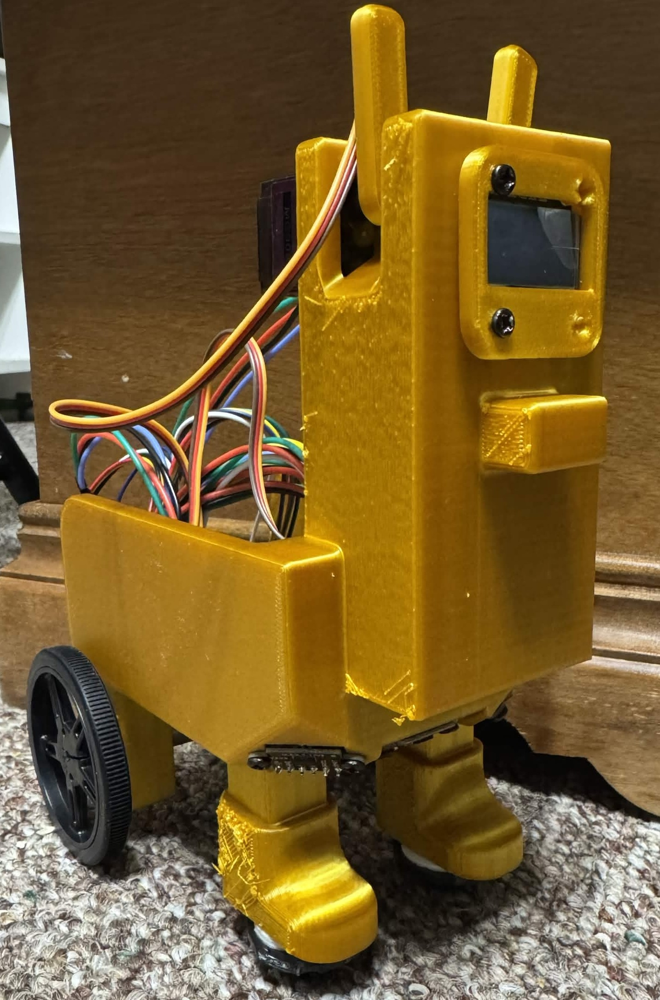

# Desk Buddy Robot

## Project Overview

The Desk Buddy is a small robot that can move around a desk on its own while interacting with the user. The goal of the project is to create a robot that can stay away from the edge of a desk, and show simple emotions through ear movements and facial expressions on a display.

The robot is controlled by an STM32F411CEU6 microcontroller mounted on a custom PCB. It uses two DC motors with encoders for movement, two servo motors for ear motion, and Time of Flight sensors for edge detection. An OLED display is used to show faces and animations, while buttons allow the user to interact with the robot.

This project combines embedded programming, PCB design, sensor integration, motor control, and mechanical design into a single system.

    
    
<em>Figure 1: Final robot assembly.</em>

\htmlonly

    <video width="400" controls>
        <source src="demo.mp4" type="video/mp4">
        Your browser does not support the video tag.
    </video>
    
<em>Figure 2: Desk Buddy demonstration.</em>

\endhtmlonly

---

## Project Features

* Drives around a desk without falling off
* Uses encoder feedback for motor control
* Custom PCB based on an STM32F411CEU6
* OLED display for facial expressions
* Servo driven ears for movement and interaction

## Major Hardware Components

| Component               | Purpose                               |
| ----------------------- | ------------------------------------- |
| STM32F411CEU6           | Main microcontroller                  |
| DC Motors with Encoders | Movement and speed feedback           |
| Servo Motors            | Ear movement                          |
| ToF Sensors             | Edge detection                        |
| OLED Display            | Facial expressions and feedback       |
| Custom PCB              | Connects and controls all electronics |

---

## Source Code

The complete source code for the Desk Buddy project is available on GitHub.
GitHub Repository:
https://github.com/israelvillegas123/ME-507

---

## Documentation

### Hardware

@subpage hardware

### Custom PCB

@subpage pcb

### Robot Design

@subpage robot_design

### Software 

@subpage software

### Modeling and Control

@subpage modeling

### Code Functions

@subpage code_functions

---

