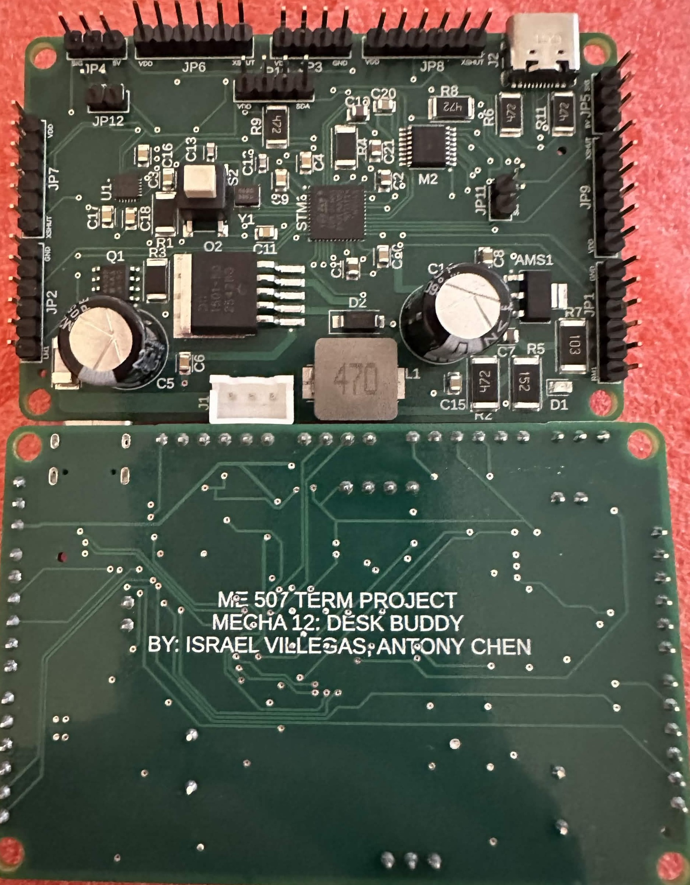
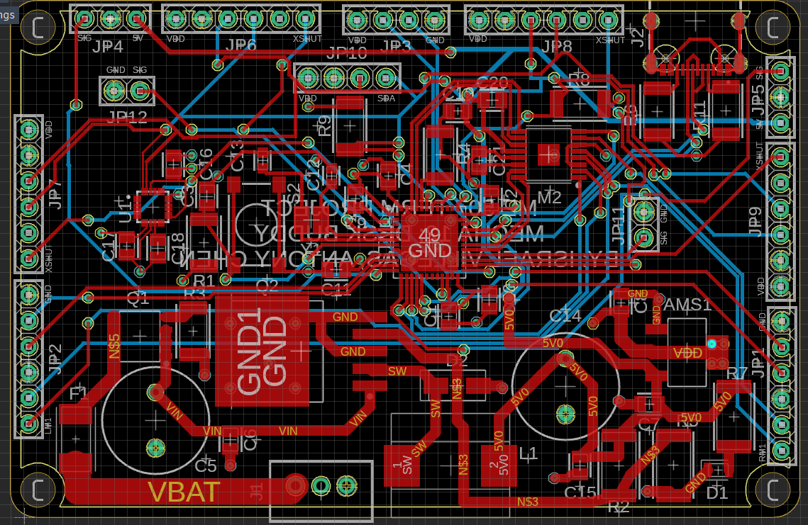

# Custom PCB {#pcb}

## Overview

The Desk Buddy uses a custom PCB to connect and control all of the main electronics on the robot.

The PCB holds the STM32 microcontroller, power regulation parts, motor driver, connectors, sensors, and supporting components. This keeps the wiring cleaner and makes the robot easier to assemble compared to using a bunch of separate breakout boards.

    
    
<em>Figure 1: Final PCB assembly.</em>

    
    
<em>Figure 2: PCB layout and traces.</em>

---

## Main PCB Features

The PCB includes:

- STM32F411 microcontroller
- 5 V buck converter
- 3.3 V linear regulator
- DRV8833 motor driver
- USB-C connector
- ICM-20948 IMU
- Crystal oscillator
- Connectors for motors, servos, ToF sensors, OLED display, and battery
- Fuse and protection components

---

## Power System

The robot is powered by a 7.4 V battery.

The PCB steps this voltage down to power the different parts of the robot:

| Voltage | Used For |
|---------|----------|
| 7.4 V Battery | Main power input |
| 5 V | Servos and DC motors |
| 3.3 V | STM32, sensors, and logic signals |

A fuse is included to help protect the board if something goes wrong.

---

## Motor Control

The PCB uses a DRV8833 motor driver to control the two DC motors.

The STM32 sends control signals to the motor driver, and the motor driver provides the power needed to drive the motors.

---

## Connectors

Pin headers are used to connect external parts to the PCB, including:

- DC motors
- Servo motors
- ToF sensors
- OLED screen
- Battery
- Programming/debug connections
- User interface parts

These connectors allow the the external parts send and recieve data from the board.

---

## PCB Bill of Materials

| Item | Quantity | Designator | JLCPCB Number | Source | Package |
|------|----------|------------|---------------|--------|---------|
| 3.3 V Linear Regulator | 1 | AMS1 | C6186 | JLCPCB | SOT-223 |
| 4.7 uF Capacitor | 2 | C1, C2 | C1779 | JLCPCB | 0805 |
| 100 nF Capacitor | 10 | C3, C4, C6, C9, C10, C11, C15, C16, C17, C18 | C1711 | JLCPCB | 0805 |
| 470 uF Capacitor | 2 | C5, C14 | C338188 | JLCPCB | Plugin, D10xL12.5mm |
| 10 uF Capacitor | 2 | C7, C19 | C15850 | JLCPCB | 0805 |
| 22 uF Capacitor | 1 | C8 | C29277 | JLCPCB | 0805 |
| 6 pF Capacitor | 2 | C12, C13 | C170142 | JLCPCB | 0603 |
| 0.01 uF Capacitor | 1 | C20 | C1710 | JLCPCB | 0805 |
| 2.2 uF Capacitor | 1 | C21 | C377773 | JLCPCB | 0805 |
| LED | 1 | D1 | C2292 | JLCPCB | 0805 |
| Diode | 1 | D2 | C8678 | JLCPCB | SMA / DO-214AC |
| 7 A Fuse | 1 | F1 | C3158084 | JLCPCB | SMD, 6.1x2.5mm |
| 3 Pin XH Header | 1 | J1 | C144394 | JLCPCB | Plugin, P=2.5mm |
| USB-C Connector | 1 | J2 | C3025063 | JLCPCB | SMD |
| 1x6 Pin Header | 6 | JP1, JP2, JP6, JP7, JP8, JP9 | C5444523 | JLCPCB | Plugin, P=2.54mm |
| 1x2 Pin Header | 2 | JP11, JP12 | C2915055 | JLCPCB | Plugin, P=2.54mm |
| 1x4 Pin Header | 2 | JP3, JP10 | C5184785 | JLCPCB | Plugin, P=2.54mm |
| 1x3 Pin Header | 2 | JP4, JP5 | C2915006 | JLCPCB | Plugin, P=2.54mm |
| 46 uH Inductor | 1 | L1 | C6364681 | JLCPCB | SMD, 11.6x10.1mm |
| DRV8833 Motor Driver | 1 | M2 | C50506 | JLCPCB | TSSOP-16-EP |
| P-Channel MOSFET | 1 | Q1 | C727481 | JLCPCB | 8-SO |
| 5 V Buck Converter | 1 | Q2 | C9980 | JLCPCB | TO-263-5 |
| 10k 1 W Resistor | 3 | R1, R3, R4 | C2081198 | JLCPCB | 2010 |
| 4.7k 2 W Resistor | 1 | R2 | C33178 | JLCPCB | 2512 |
| 1.5k 2 W Resistor | 1 | R5 | C26071 | JLCPCB | 2512 |
| 4.7k 1 W Resistor | 4 | R6, R8, R9, R11 | C2770395 | JLCPCB | 2010 |
| 10k 2 W Resistor | 1 | R7 | C25718 | JLCPCB | 2512 |
| Switch | 1 | S2 | C22438501 | JLCPCB | SMD-4P, 5.9x5.9mm |
| STM32F411CEU6 | 1 | STM1 | C60420 | JLCPCB | UFQFPN-48, 7x7mm |
| ICM-20948 IMU | 1 | U1 | C726001 | JLCPCB | QFN-24, 3x3mm |
| Crystal | 1 | Y1 | C189764 | JLCPCB | SMD3225-2P |
| DC Motors | 2 | N/A | 5210 | Pololu | N/A |
| Servo Motors | 2 | N/A | N/A | Amazon | N/A |
| 7.4 V Battery | 1 | N/A | N/A | N/A | N/A |
| ToF Sensors | 4 | N/A | N/A | Amazon | N/A |
| OLED Screen | 1 | N/A | N/A | Amazon | N/A |

