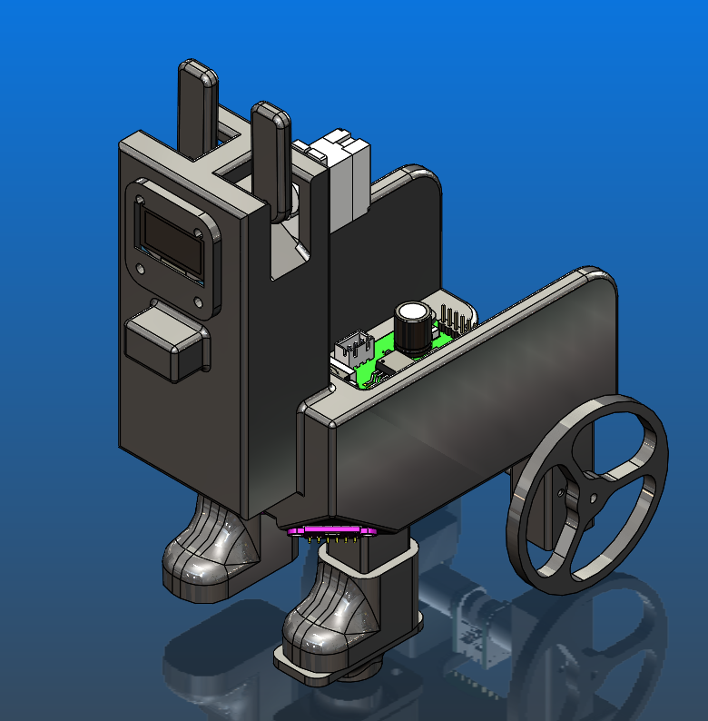
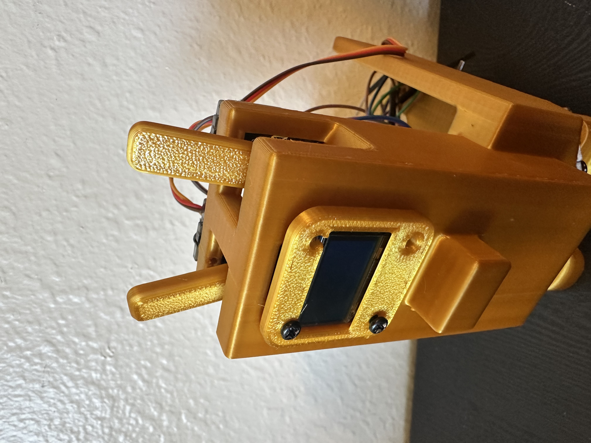
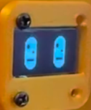
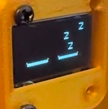
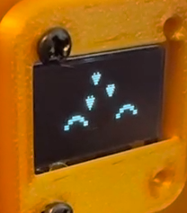
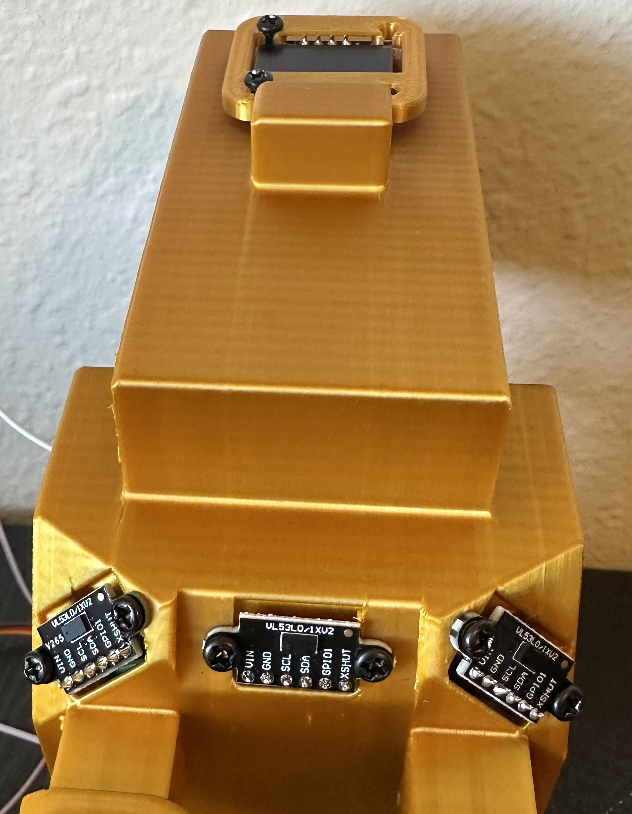

# Robot Design {#robot_design}

## Overview

The Desk Buddy was designed to look like a small llama while still providing enough space for the electronics, battery, sensors, and motors.

The goal was to create a robot that feels more like a desk friend than a traditional robot. The final design has a simple design with features that give the robot personality, including movable ears and animated facial expressions displayed on an OLED screen.

---

## CAD Model

The robot was modeled in CAD before 3D printing it and checking overall dimensions.

    
    
<em>Figure 1: CAD model of the Desk Buddy robot.</em>

---

## Ear Mechanism

One of the main design goals was to give the robot personality.

Two servo-driven ears are mounted on top of the robot. These ears move independently and can be used to express different emotions or reactions.

Examples include:

* Sleeping
* Reacting to edges
* Indicating when being pet

    
    
<em>Figure 2: Ear mechanism.</em>

---

## Eyes and Display

An OLED display is mounted on the front of the robot.

The display is used to show:

* Eyes
* Differnet expressions
* Simple animations

This helps make the robot feel more interactive and engaging.

    
    
    
    
<em>Figure 3: Different eye settings.</em>

---

## Drive System

The robot is driven by two DC gear motors with an encoders. We have caster wheels to provide stability while allowing smooth movement. 
The motors speed is controlled by a PI controller so that the robot drive at one set speed.

---

## Sensor Placement

The sensors were positioned to allow the robot to safely move around a desk. This arrangement allows the robot to read the distance from mutliple direction which prevents it falling off the edge.

    
    
<em>Figure 4: Sensor positions.</em>

---

## Manufacturing

The entire thing was 3D printed in PLA filament. This allowed for quick iterations and low cost construction. 

